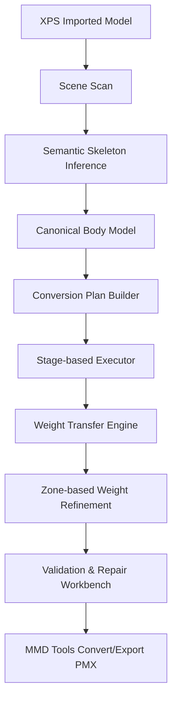
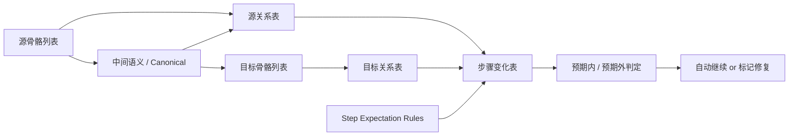

# 通用 XPS -> MMD 转换工具架构设计

> 2026-03-26 更新说明
>
> 本文档已从“通用转换链路”升级为“自动转换系统 + 诊断修复工作台”的设计版本。
> 设计目标不再只是把当前样例转对，而是尽量支持任意 XPS 风格人形骨架：
>
> - 自动识别
> - 自动规划
> - 分阶段执行
> - 每步验证
> - 可人工介入修复

## 1. 目标定义

本项目的目标，不应简单定义为“把 XPS 文件转成 PMX 文件”，而应定义为：

- 输入：任意来源、结构差异较大的 XPS 风格角色骨架
- 输出：一个可验证、可修复、可导出 PMX 的 MMD-ready 中间状态
- 特点：自动转换优先，但允许检测失败后进入半自动修复

也就是说，优先追求：

- 自动识别
- 自动转换
- 自动诊断
- 快速定位失败点

而不是一开始就追求“任何模型都 100% 一键完美”。

---

## 2. 核心设计原则

### 2.1 不直接从 XPS 骨骼跳到最终 MMD 骨骼

不要采用这种思路：

- `XPS bone A -> MMD bone B`
- `XPS bone C -> MMD bone D`

而应该采用分层设计：

1. 识别原始骨骼的语义
2. 归一化成统一的人体中间模型
3. 构建 MMD 控制骨架和变形骨架
4. 将原始权重先映射到中间语义层
5. 再投影到 MMD deform 骨
6. 最后对局部区域做渐变和 cleanup

### 2.2 控制骨和变形骨必须分离

MMD 的很多骨骼不是直接负责网格变形，而是承担：

- 控制
- IK
- 付与
- 驱动

而 XPS 常常是较直接的变形链。

因此必须明确区分：

- MMD 控制层
- MMD 变形层

### 2.3 权重处理必须区域隔离

全局统一 cleanup / normalize 会破坏：

- 髋部过渡区
- 膝盖过渡区
- 中线区域的左右独立性

因此权重处理应按区域分层：

- 上半身
- 髋部/腹股沟过渡区
- 下半身
- 必要时再细分肩部、膝盖、手腕等区域

### 2.4 每一步都必须能输出可解释的差分

工具必须能回答：

- 哪一步改坏了
- 改了哪些骨
- 改了哪些区域
- 改了哪些顶点

否则“通用转换”无法长期维护。

### 2.5 应坚持“先结构，后权重，最后局部修带”

当前项目里最容易反复出问题的，不是“骨骼有没有建出来”，而是：

- helper 转移后局部权重带被洗坏
- 腿根 / 髋部 / 内侧中线被错误 cleanup
- 左右 D 骨互相污染

因此顶层流程应明确分层：

1. 语义与映射层
2. 主干结构层
3. D骨 / helper / twist 层
4. 局部过渡带修复层
5. 自动验证层

不要把“结构生成”和“局部权重修带”混在同一步里。

---

## 3. 整体转换架构



这条链路表示：

1. 先扫描 Blender 中导入的 XPS 模型
2. 识别骨骼语义
3. 归一化成内部统一的人体模型
4. 先生成转换计划
5. 再按阶段执行转换
6. 迁移原始权重
7. 按区域精修权重
8. 做验证、差分与修复
9. 最后交给 `mmd_tools` 导出 PMX

---

## 4. 各层职责

### 4.1 输入层：XPS Imported Model

这里的输入不应被当成“格式文件”，而应被当成：

- 一组 Blender mesh
- 一组 Blender armature bones
- 一堆 vertex groups
- 一些来源不稳定的辅助骨

这一层不修改数据，只做扫描。

需要提取的信息：

- 骨骼树结构
- 骨骼世界坐标
- 骨骼名称模式
- 顶点组分布
- 左右对称候选
- 关键部位骨骼候选
- 网格包围盒、角色朝向、比例

---

### 4.2 语义识别层：Scene Scan -> Semantic Skeleton Inference

这一层只关心骨骼在身体中的“角色”，而不是最终名字。

例如统一识别成：

- `pelvis`
- `spine_lower`
- `spine_mid`
- `spine_upper`
- `upper_arm_l`
- `lower_arm_l`
- `thigh_l`
- `calf_l`
- `foot_l`
- `pelvis_helper`
- `inner_thigh_helper_l`
- `twist_helper_r`

建议组合三种规则：

- 名称规则
- 拓扑规则
- 空间规则

输出：

- 语义骨架映射 `Semantic Skeleton`

---

### 4.3 中间规范层：Canonical Body Model

这一层用于把来源差异先消化掉，形成项目内部统一的人体模型。

例如：

- torso
- left_leg
- right_leg
- left_arm
- right_arm
- helpers

这一层的意义：

- 后续逻辑不再直接依赖原始骨名
- 不同来源模型只要识别到同一语义，就能复用同一套 MMD 构造逻辑

输出：

- `CanonicalBodyModel`

---

### 4.3.1 目标骨架也应进入 canonical

如果目标是“尽量通用，自动为主，必要时人工修复”，则不仅源 XPS 要进入 canonical，
目标 PMX / MMD 骨架也应进入同一套 canonical。

意义：

- 可以对比 `source canonical` 与 `target canonical`
- 可以先看清楚“差的是什么”，再决定“怎么补”
- 可以避免把某一个参考 PMX 的具体骨名写死成唯一模板

输出：

- `SourceCanonicalBodyModel`
- `TargetCanonicalBodyModel`

---

### 4.3.2 canonical 不只是字段表

最终 canonical 不应只是一组平铺字段，而应能表达：

- torso chain
- left arm chain
- right arm chain
- left leg chain
- right leg chain
- head / neck chain
- helper / twist 集合
- 缺失项
- 置信度

这样后续逻辑可以真正依赖“结构”和“角色”，而不只是依赖骨名。

---

## 4.3.3 可见关系表与预期规则

为了让“骨骼”和“顶点权重”的变化可解释，工具应内建三张可见表，而不是只在出错后靠肉眼看模型。

### A. 源关系表：XPS / 中间语义 / 当前权重

这张表回答：

- 源骨骼是什么
- 它被识别成什么中间语义
- 它当前实际控制哪些顶点
- 它是来源骨、helper，还是已迁移到目标 deform 骨

建议字段：

- 源骨名
- 中间语义角色
- 当前对应顶点组
- 带权顶点数
- 总权重
- 主要影响区域
- 几何左右侧
- 类型
  - `source / helper / control_candidate / deform_candidate`
- 状态
  - `正常 / 待迁移 / 已迁移 / 异常`

### B. 目标关系表：MMD 骨骼 / 当前权重 / 来源

这张表回答：

- 当前 MMD 骨骼是否已存在
- 它是否已有顶点组
- 它是控制骨还是变形骨
- 它的权重当前来自哪些源骨/中间语义

建议字段：

- 目标骨名
- 骨类型
  - `deform / control / helper`
- 当前顶点组是否存在
- 带权顶点数
- 总权重
- 主要影响区域
- 来源骨/来源语义
- 状态
  - `正常 / 缺失 / 空权重 / 待修复`

### C. 步骤变化表：本步骤改了什么

这张表回答：

- 当前步骤新增了哪些骨
- 改了哪些顶点组
- 哪些变化是预期内
- 哪些变化是预期外

建议字段：

- `step_id`
- 项目类型
  - `bone / vertex_group / weight_relation / warning`
- 名称
- `before`
- `after`
- `expected`
  - `expected / expected_risky / unexpected`
- `severity`
  - `info / warning / error`
- `note`

### D. 预期规则

每一步都应维护一份“允许发生什么 / 不允许发生什么”的规则。

示例：

- `Step 1 重命名`
  - 预期内：主干骨重命名、顶点组同名重命名
  - 预期外：主干骨仍保留旧名、主干顶点组消失

- `Step 2 补全缺失骨骼`
  - 预期内：新增 `センター / グルーブ / 全ての親 / 足D`
  - 预期内：`下半身` 至少有基础顶点组
  - 预期外：`下半身` 顶点组不存在、D骨存在但腿根完全无带权顶点

- `Step 3 骨骼切分`
  - 预期内：躯干链变化、`上半身3` 新增
  - 预期外：腿部区域大幅异常变化

- `Step 4 helper 转移`
  - 预期内：helper 组减少、目标组增加
  - 预期内但高风险：髋部 / 腿根 / 内侧带变化明显
  - 预期外：关键 deform 组权重消失、左右串侧增加

这套机制的目标是：

- 让“预期内变化”和“预期外变化”显式分开
- 让工具能回答“是哪一步第一次把某块区域改坏了”

### E. 数据流草图



对当前项目的直接意义是：

- 现在 `Step 2` 的腿根 D骨问题，不应再等用户摆姿势后才发现
- 它应该在“目标关系表 + 步骤变化表”里直接暴露成：
  - `下半身 顶点组缺失`
  - `unexpected`

---

### 4.4 规划层：Conversion Plan Builder

这是通用工具里最关键、当前也最缺的一层。

它的职责不是直接改模型，而是先回答：

- 哪些源骨可以直接复用
- 哪些源骨只是 helper
- 哪些目标骨需要新建
- 哪些控制骨后加即可
- 哪些区域是高风险区域
- 哪些阶段可以全自动
- 哪些阶段需要用户确认

建议输出：

- `ConversionPlan`

建议包含这些内容：

- `source_profile_guess`

---

## 5. 自动化测试设计

当前人工 Blender 测试成本太高，已经成为推进速度的主要瓶颈。
建议把自动化测试正式纳入顶层设计，而不是继续作为临时调试手段。

### 5.1 测试目标

自动化测试要回答 4 个问题：

1. 这一步改了哪些骨和哪些区域
2. 这一步有没有把关键区域洗坏
3. 当前姿态下局部变形是不是明显偏离目标
4. 问题发生在第几步，而不是“最后看起来不对”

### 5.2 建议测试分层

#### A. 静态结构测试

每一步后自动检查：

- 关键骨是否存在
- 关键骨是否仍是 deform / control 的正确类型
- 映射字段是否仍指向存在的骨

#### B. 静态权重测试

每一步后自动记录：

- `下半身 / 足D / ひざD / 足首D` 的区域平均值
- 中线污染计数
- 左右串侧计数
- 髋部硬切割计数
- 冲突顶点计数

#### C. 标准姿态测试

建议内置最少 4 个 pose：

- 左腿前抬
- 右腿前抬
- 左腿外摆
- 右腿外摆

并在 pose 后自动检测：

- 大腿根
- 臀腿交界
- 大腿内侧
- 裆部中线

#### D. 参考骨架对比测试

如果场景里有参考 PMX，则自动对比：

- 同一区域平均权重分布
- 关键顶点区域的骨占比
- 哪些区域当前明显偏离参考

### 5.3 最适合先落地的自动化测试

明天最值得优先讨论和实现的是：

1. `step snapshot`
   每一步后保存一份区域统计 JSON

2. `pose regression`
   固定 4 个腿部 pose 自动执行并输出摘要

3. `reference diff`
   如果存在目标 PMX，则自动输出：
   - 腿根上缘
   - 大腿内侧
   - 髋部顶部
   的平均权重差异

4. `step blame`
   自动指出“是 2 / 3 / 4 中的哪一步第一次把这块区域洗坏”
- `semantic_confidence_summary`
- `direct_mapping`
- `missing_target_roles`
- `helper_redirect_plan`
- `stage_execution_plan`
- `risk_flags`
- `manual_review_items`

这个 plan 是把“固定按钮顺序”升级成“按识别结果执行”的关键。

---

### 4.4 MMD 骨架构造层：MMD Skeleton Builder

这一层开始生成目标 MMD 结构，但要明确分两类：

#### 控制层

- `全ての親`
- `センター`
- `グルーブ`
- `腰`
- FK 腿骨
- IK 骨
- IK parent
- 扭转控制骨

#### 变形层

- `上半身`
- `上半身1`
- `上半身2`
- `下半身`
- `足D`
- `ひざD`
- `足首D`
- `足先EX`
- `腕捩`
- `手捩`

输出：

- MMD 控制骨架
- MMD 变形骨架
- additional transform / IK / 约束设置

---

### 4.4.1 构造应按阶段执行，而不是一口气全部生成

建议将执行拆成固定阶段：

- Stage A: 源骨架识别
- Stage B: 自动填骨映射
- Stage C: 主干骨重命名 / 对齐
- Stage D: 缺失骨与基础结构生成
- Stage E: 脊柱 / 肩部结构细化
- Stage F: helper / twist / hip 权重处理
- Stage G: 验证与修复
- Stage H: 导出准备

当前实践上，推荐顺序进一步明确为：

- 先 `补全缺失骨骼`
- 再 `骨骼切分`
- 再进入 `4 helper 权重转移`

也就是“先结构，后高风险权重”。

要求：

- 每个阶段都可以单独执行
- 每个阶段都可以单独验证
- 每个阶段都可以输出差分

---

### 4.5 权重迁移层：Weight Transfer Engine

这一层负责把原始 XPS 的权重迁移到 MMD deform 骨，但不做最终 cleanup。

主要职责：

1. 直接继承
2. 辅助骨重定向
3. 多源合并

例如：

- `thigh_l -> 足D.L`
- `calf_l -> ひざD.L`
- `foot_l -> 足首D.L`
- `pelvis_helper -> 下半身`

这一层输出的是：

- `Raw Transferred Weights`

不是最终权重。

---

### 4.6 区域精修层：Zone-based Weight Refinement

这是专门解决“为什么转换后动起来不对”的地方。

建议固定三大区：

- Zone 1: 上半身
- Zone 2: 髋部/腹股沟过渡区
- Zone 3: 下半身

如果要做成通用工具，最终还应扩展到：

- shoulder zone
- forearm twist zone
- knee transition zone
- wrist zone

因为这些区域在不同来源模型中都很容易出问题。

---

### 4.7 验证与修复层：Validation & Repair Workbench

如果工具目标是“自动优先，但允许人工修复”，则验证与修复层必须是一级公民，
不能只做成一两个调试按钮。

建议分三层验证：

#### 结构验证

- 关键骨是否存在
- 父子关系是否符合预期
- 控制骨 / 变形骨是否分离

#### 权重验证

- 关键骨是否仍有权重
- 区域权重是否异常下跌
- 是否出现左右串侧
- 是否出现过多冲突顶点
- 是否出现髋部 / 膝盖的硬切割

#### pose 验证

- 抬左腿
- 抬右腿
- 左膝弯曲
- 右膝弯曲
- 左臂抬起
- 右臂抬起
- 躯干前倾

输出必须能回答：

- 哪一步有风险
- 哪个区域有风险
- 是预期内中间风险，还是异常风险
- 建议自动修复还是人工修复

---

## 5. 自动与人工修复的边界

### 5.1 适合自动修复的问题

- helper redirect
- orphan weight redirect
- 缺失目标顶点组补齐
- 已知 profile 规则下的辅助骨转移
- 已知安全区间内的髋部 / 肩部局部修正

### 5.2 适合人工确认的问题

- 语义识别置信度低
- 左右方向不明确
- 非标准扭转骨 / 辅助骨结构
- 目标骨架中存在多套可选控制结构
- 某个区域多次自动修复后仍不稳定

### 5.3 工具的设计原则

通用工具不应追求“任何模型都全自动完美”。

更合理的目标是：

- 80% 流程自动完成
- 20% 高风险部分有清晰诊断和人工介入入口

---

## 6. UI 设计建议

最终 UI 不应只是一排步骤按钮，建议分成三个工作区块：

### 6.1 扫描与计划

显示：

- 当前源骨架识别结果
- 置信度
- profile 猜测
- 缺失项
- conversion plan 摘要

### 6.2 分阶段执行

显示：

- 当前阶段
- 已完成 / 进行中 / 待确认
- 自动步骤结果
- 高风险步骤提示

### 6.3 诊断与修复

显示：

- 骨级差异
- 区域级差异
- pose 测试结果
- 推荐修复动作
- 手动修复入口

---

## 7. 与当前仓库代码的对应关系

### 7.1 已有可复用模块

- 语义识别基础：`semantic/`
- canonical 基础：`canonical/`
- profile 基础：`profiles/`
- 权重快照 / diff / 验证：`weights/`
- 自动流程入口：`operators/auto_convert_operator.py`
- 结构生成 / 权重转移核心：`operators/bone_operator.py`
- 结构细化：`operators/bone_split_operator.py`
- 扭转骨与 IK：`operators/twist_bone_operator.py`、`operators/ik_operator.py`

### 7.2 当前最缺的模块

- conversion plan builder
- source/target 双边 canonical 对比
- pose-based regression test
- 区域级可视化修复面板

---

## 8. 推荐迭代顺序

建议按以下顺序推进，而不是继续在旧 operator 里堆特判：

1. 完成源 / 目标双边语义扫描
2. 让语义结果自动填充现有骨映射字段
3. 新增 `ConversionPlan`
4. 让 `auto_convert` 从固定顺序改为按 plan 执行
5. 完善区域级权重验证与修复
6. 加入固定 pose 的回归测试
7. 最后再增强 profile 与自动率

---

## 9. 设计结论

如果目标是“尽量支持任意 XPS 自动转成 PMX，并允许人工检查和修复”，
则该项目最合理的定位不是“一组转换脚本”，而是：

> 一个 Blender 内的人形骨架转换工作台

它需要同时具备：

- 自动识别
- 自动规划
- 分阶段执行
- 每步验证
- 人工修复入口

自动转换是核心能力，
诊断、计划、测试、修复是它能否真正通用的关键。

必要时细分：

- 膝盖区
- 肩部区
- 手腕扭转区

每个区域只允许做自己的规则：

- 上半身：可 aggressive cleanup
- 髋部：保留渐变，不做全局 normalize
- 下半身：按左右腿独立处理
- 膝盖：保留 bend transition
- 中线：防止左右串侧

输出：

- `MMD-ready Deformation Weights`

---

### 4.7 验证与差分层：Validation & Diff Report

这一层不是附属功能，而应是主流程的一部分。

建议验证分成四类：

1. 结构验证
2. 权重验证
3. 区域验证
4. 姿态验证

输出：

- `Conversion Report`

它应明确回答：

- 哪一步改动最大
- 哪些骨的权重发生异常变化
- 哪些区域出现风险
- 是否可安全导出 PMX

---

### 4.8 导出层：MMD Tools Convert/Export PMX

导出层只负责把前面已经准备好的 MMD-ready 状态交给 `mmd_tools`。

它不是修问题的地方。

因此 PMX 导出应放在流程最后一步，而不是转换逻辑的一部分。

---

## 5. 推荐目录结构

```text
Convert-to-MMD/
├─ __init__.py
├─ ui/
│  ├─ panel_main.py
│  ├─ panel_mapping.py
│  ├─ panel_debug.py
│  └─ state.py
├─ operators/
│  ├─ scan_operator.py
│  ├─ infer_operator.py
│  ├─ build_operator.py
│  ├─ transfer_operator.py
│  ├─ validate_operator.py
│  ├─ workflow_operator.py
│  └─ export_operator.py
├─ core/
│  ├─ blender_context.py
│  ├─ armature_access.py
│  ├─ mesh_access.py
│  ├─ report.py
│  └─ constants.py
├─ semantic/
│  ├─ types.py
│  ├─ naming_rules.py
│  ├─ topology_rules.py
│  ├─ spatial_rules.py
│  └─ infer.py
├─ canonical/
│  ├─ model.py
│  └─ normalize.py
├─ mmd/
│  ├─ schema.py
│  ├─ builder.py
│  ├─ ik_builder.py
│  ├─ twist_builder.py
│  └─ groups.py
├─ weights/
│  ├─ snapshot.py
│  ├─ diff.py
│  ├─ transfer.py
│  ├─ redirects.py
│  ├─ zones.py
│  ├─ refine_upper.py
│  ├─ refine_hip.py
│  ├─ refine_lower.py
│  ├─ cleanup.py
│  └─ validate.py
├─ profiles/
│  ├─ base_profile.py
│  ├─ xna_lara.py
│  └─ generic_xps.py
└─ tests/
```

---

## 6. 核心数据结构建议

### 6.1 SemanticBone

用于描述原始骨骼被识别出的语义。

```python
from dataclasses import dataclass, field
from typing import Literal

SemanticRole = Literal[
    "root", "pelvis", "spine_lower", "spine_mid", "spine_upper",
    "neck", "head",
    "clavicle_l", "clavicle_r",
    "upper_arm_l", "upper_arm_r",
    "lower_arm_l", "lower_arm_r",
    "hand_l", "hand_r",
    "thigh_l", "thigh_r",
    "calf_l", "calf_r",
    "foot_l", "foot_r",
    "toe_l", "toe_r",
    "eye_l", "eye_r",
    "pelvis_helper", "inner_thigh_helper_l", "inner_thigh_helper_r",
    "twist_helper_l", "twist_helper_r",
    "unknown",
]

@dataclass
class SemanticBone:
    source_name: str
    role: SemanticRole
    confidence: float
    reasons: list[str] = field(default_factory=list)
```

### 6.2 CanonicalBodyModel

用于统一描述人体结构。

```python
from dataclasses import dataclass

@dataclass
class CanonicalBodyModel:
    pelvis: str | None = None
    spine_lower: str | None = None
    spine_mid: str | None = None
    spine_upper: str | None = None
    neck: str | None = None
    head: str | None = None
    thigh_l: str | None = None
    thigh_r: str | None = None
    calf_l: str | None = None
    calf_r: str | None = None
    foot_l: str | None = None
    foot_r: str | None = None
    toe_l: str | None = None
    toe_r: str | None = None
    upper_arm_l: str | None = None
    upper_arm_r: str | None = None
    lower_arm_l: str | None = None
    lower_arm_r: str | None = None
    hand_l: str | None = None
    hand_r: str | None = None
    helpers: dict[str, list[str]] | None = None
```

### 6.3 WeightSnapshot

用于记录每一步的权重快照。

```python
from dataclasses import dataclass, field

@dataclass
class BoneWeightStats:
    vertex_count: int = 0
    weight_sum: float = 0.0

@dataclass
class WeightSnapshot:
    bone_stats: dict[str, BoneWeightStats] = field(default_factory=dict)
    region_stats: dict[str, dict[str, float]] = field(default_factory=dict)
    changed_vertices_sample: list[dict] = field(default_factory=list)
```

### 6.4 WeightDiff

用于记录步骤前后的差分结果。

```python
from dataclasses import dataclass, field

@dataclass
class WeightDiff:
    changed_bones: list[dict] = field(default_factory=list)
    changed_regions: list[dict] = field(default_factory=list)
    changed_vertices: list[dict] = field(default_factory=list)
    warnings: list[str] = field(default_factory=list)
```

---

## 7. 关键模块职责

### 7.1 `semantic/infer.py`

职责：

- 将 Blender 骨架识别为语义骨架
- 综合名称、拓扑、空间三种规则

建议接口：

```python
def infer_semantic_bones(armature_obj) -> list[SemanticBone]:
    ...
```

### 7.2 `canonical/normalize.py`

职责：

- 将多个 `SemanticBone` 归并为统一人体模型

建议接口：

```python
def build_canonical_body_model(semantic_bones: list[SemanticBone]) -> CanonicalBodyModel:
    ...
```

### 7.3 `mmd/builder.py`

职责：

- 根据 `CanonicalBodyModel` 创建/更新 MMD 骨架
- 只负责结构，不直接处理权重

建议接口：

```python
from dataclasses import dataclass

@dataclass
class MmdBuildResult:
    created_bones: list[str]
    updated_bones: list[str]
    warnings: list[str]

def build_mmd_skeleton(context, armature_obj, model: CanonicalBodyModel) -> MmdBuildResult:
    ...
```

### 7.4 `weights/transfer.py`

职责：

- 将原始 XPS 权重迁移到 MMD deform 骨
- 不做最终 cleanup，只做来源转移

建议接口：

```python
from dataclasses import dataclass

@dataclass
class TransferRule:
    source_role: str
    target_bone: str
    mode: str

def transfer_base_weights(context, armature_obj, model: CanonicalBodyModel) -> list[str]:
    ...
```

### 7.5 `weights/redirects.py`

职责：

- 处理辅助骨权重重定向
- 可 profile 化，不写死在 operator 中

建议接口：

```python
def redirect_helper_weights(context, armature_obj, profile_name: str) -> list[str]:
    ...
```

### 7.6 `weights/zones.py`

职责：

- 计算各区域的顶点 mask
- 为后续精修提供边界

建议接口：

```python
from dataclasses import dataclass

@dataclass
class ZoneMasks:
    upper: set[int]
    hip: set[int]
    lower: set[int]
    knee_l: set[int]
    knee_r: set[int]

def build_zone_masks(mesh_obj, armature_obj, model: CanonicalBodyModel) -> ZoneMasks:
    ...
```

### 7.7 `weights/refine_hip.py`

职责：

- 只负责髋部过渡区
- 不允许碰上半身和膝盖区

建议接口：

```python
def refine_hip_blend(context, armature_obj, mesh_objects, model: CanonicalBodyModel, masks) -> int:
    ...
```

### 7.8 `weights/cleanup.py`

职责：

- 清理非变形骨残留
- 清理孤儿组
- 清理冲突骨对
- 必须是区域化调用，不允许无脑全局处理

建议接口：

```python
def cleanup_leg_torso_conflict(...):
    ...

def cleanup_nondeform_weights(...):
    ...

def cleanup_orphan_groups(...):
    ...
```

### 7.9 `weights/validate.py`

职责：

- 统一权重验证入口

建议接口：

```python
from dataclasses import dataclass

@dataclass
class ValidationResult:
    ok: bool
    warnings: list[str]
    errors: list[str]

def validate_weights(context, armature_obj, mesh_objects) -> ValidationResult:
    ...
```

---

## 8. Workflow 编排建议

应保留一个总编排入口，而不是把逻辑散在各个 operator 中。

建议形态：

```python
def run_full_conversion(context, armature_obj, profile_name: str = "generic_xps"):
    semantic = infer_semantic_bones(armature_obj)
    canonical = build_canonical_body_model(semantic)
    build_result = build_mmd_skeleton(context, armature_obj, canonical)

    snap_before = take_weight_snapshot(context, armature_obj)

    transfer_base_weights(context, armature_obj, canonical)
    redirect_helper_weights(context, armature_obj, profile_name)

    refine_hip_blend(...)
    refine_lower_body(...)
    cleanup_nondeform_weights(...)
    cleanup_leg_torso_conflict(...)

    snap_after = take_weight_snapshot(context, armature_obj)
    diff = diff_snapshots(snap_before, snap_after)
    result = validate_weights(context, armature_obj, ...)

    return canonical, build_result, diff, result
```

---

## 9. Profile 设计

如果目标是做“通用工具”，profile 必须存在。

### 9.1 Base Profile

- 默认规则
- 不依赖特定骨名

### 9.2 XNA Lara Profile

- 针对常见 XPS / XNA Lara 命名
- 包含 `xtra02 / xtra04 / xtra08 / xtra08opp` 等规则

### 9.3 Generic XPS Profile

- 识别更宽松
- 重定向更保守
- 适合通用模型

建议接口：

```python
from dataclasses import dataclass

@dataclass
class ConversionProfile:
    name: str
    name_aliases: dict[str, str]
    helper_redirects: dict[str, str]
    thresholds: dict[str, float]
```

---

## 10. 对历史遗留问题的设计回应

### 10.1 “MMD 的骨骼和 XPS 骨骼的区别，是否应该一层一层给权重？”

结论：

- 应该按“语义层/职责层”一层一层处理
- 不应该直接把原始 XPS 骨名平移到最终 MMD deform 骨

建议顺序：

1. 识别原始骨语义
2. 建立 MMD 控制链
3. 建立 MMD 变形链
4. 先将原始权重映射到中间语义骨
5. 再投影到最终 MMD deform 骨
6. 最后再做局部渐变和 cleanup

### 10.2 “每一步操作，哪些权重改了，有什么方法快速识别？”

建议使用三层差分系统：

#### 骨级 diff

- 每根骨影响的顶点数
- 每根骨总权重和
- 每根骨覆盖区域变化

#### 区域级 diff

- 上半身
- 髋部过渡区
- 左右大腿
- 左右膝盖
- 中线区域

#### 顶点级 diff

- 变化最大的前 N 个顶点
- 某区域内变化最大的顶点
- 某骨相关变化最大的顶点

建议搭配：

- 快照 + diff
- 阈值报警
- 热点顶点采样
- Blender 里的可视化辅助

---

## 11. 第一阶段最值得落地的基础设施

在继续扩功能前，优先补这四样：

1. `SemanticBoneMap`
2. `WeightSnapshot`
3. `StepContract`
4. `WeightDiffReport`

其中：

### SemanticBoneMap

- 原始 XPS 骨 -> 语义骨
- 语义骨 -> MMD 控制骨 / deform 骨

### WeightSnapshot

记录：

- bone_counts
- bone_sums
- region_sums
- changed_vertices

### StepContract

每一步声明：

- allowed_bones
- allowed_regions
- expected_increase
- expected_decrease

### WeightDiffReport

输出：

- 骨级变化
- 区域级变化
- 顶点级样本
- 风险警告

---

## 12. 第一阶段最小重构顺序

不建议一开始大拆全仓，建议按以下顺序渐进迁移：

1. 新增 `semantic/types.py`
2. 新增 `canonical/model.py`
3. 新增 `weights/snapshot.py`
4. 新增 `weights/diff.py`
5. 新增 `weights/zones.py`
6. 将 `weight_monitor` 迁移到 `weights/snapshot.py`
7. 将 `_create_hip_blend_zone` 迁移到 `weights/refine_hip.py`
8. 将辅助骨 redirect 迁移到 `weights/redirects.py`
9. 最后再拆 `bone_operator.py`

这样可以在不一次性打散项目的前提下，把最关键的底层设施先建立起来。

---

## 13. 总结

通用 `XPS -> MMD` 工具，不应设计成：

- 改名
- 补骨
- 转权重
- 导出

而应设计成：

- 理解原模型
- 抽象成统一语义
- 重建 MMD 结构
- 把权重投影到 MMD 变形逻辑
- 按区域修正
- 逐步验证
- 最后导出

这套设计的意义，不只是让转换“能跑”，而是让它在面对不同来源模型时：

- 更容易扩展
- 更容易诊断
- 更容易修复
- 更容易证明每一步流程是对的
